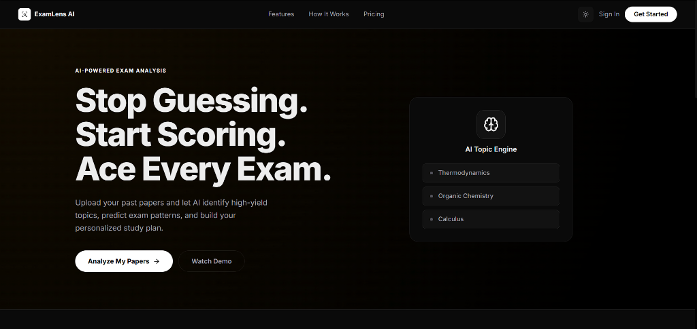
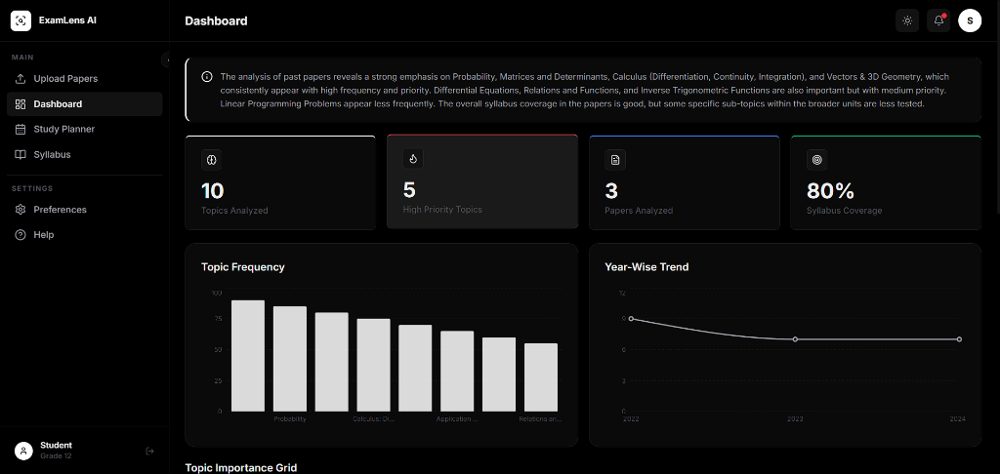
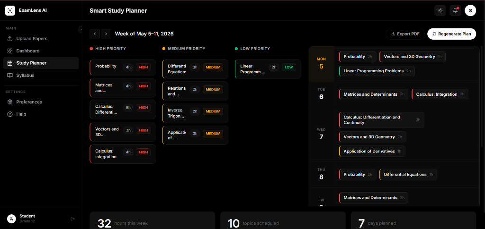
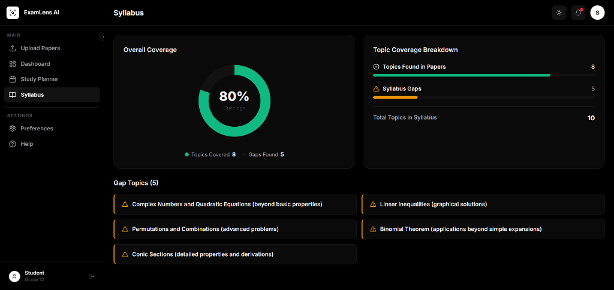

# ExamLens AI

<div align="center">


**AI-powered past paper analyzer that identifies high-yield topics, predicts exam patterns, and generates personalized study plans.**

[](https://exam-lens-ai.vercel.app/)
[](https://github.com/Pranjal685/ExamLens-AI)

</div>

---

## 📹 Demo Video

> 🎬 [Watch Full Demo on Google Drive](https://drive.google.com/file/d/1uPADQhi866KsBL8TYzYgnpjgSAFUhYqh/view?usp=sharing)

---

## 🚀 Live Demo

👉 **[examlens-ai.vercel.app](https://exam-lens-ai.vercel.app/)**

Click "Try Live Demo" on the landing page for instant access without uploading files.

---

## 🎯 Problem Statement

Students waste hours manually reviewing past papers trying to identify important topics. There is no structured way to:
- Know which topics appear most frequently
- Understand question patterns across years
- Align study time with actual exam weight
- Generate a smart prioritized study schedule

---

## 💡 Solution

ExamLens AI analyzes multiple years of past papers using AI to surface patterns humans would miss, then turns those insights into an actionable study plan.

---

## ✨ Features

| Feature | Description |
|---------|-------------|
| 📄 Multi-PDF Upload | Upload past papers from multiple years and subjects |
| 🧠 AI Pattern Analysis | Gemini AI extracts topic frequency and question patterns |
| 🖼️ Image PDF Support | Handles scanned/image-based PDFs via vision AI |
| 📊 Visual Analytics | Interactive charts showing topic frequency and year trends |
| 🎯 Topic Importance Scoring | Topics ranked by predicted exam weight |
| 📅 Smart Study Planner | Auto-generated prioritized weekly study schedule |
| 📋 Syllabus Gap Analysis | Cross-references topics against official syllabus |
| 🔮 2025 Prediction Scores | AI predicts likelihood of topics appearing next exam |
| 🌙 Dark / Light Mode | Full theme support with persistent preference |
| 💾 Session Persistence | Analysis saved across browser sessions |

---

## 🏗️ Architecture

```
User uploads PDFs
       ↓
pdf.js extracts text (page by page)
       ↓
Image-based pages → POST /api/vision → Gemini Vision → text
Text-based pages → direct extraction
       ↓
Combined text → POST /api/gemini → Gemini 2.5 Flash
       ↓
Structured JSON: topics, frequency, difficulty,
year distribution, study plan, syllabus gaps
       ↓
React UI renders analytics + study planner
Zustand persists results to localStorage
```

> **Security**: All Gemini API calls are routed through Vercel Serverless Functions (`/api/gemini`, `/api/vision`). The API key is injected server-side and never reaches the browser.

---

## 🛠️ Tech Stack

**Frontend**
- React 18 + Vite
- Tailwind CSS + shadcn/ui
- Framer Motion (animations)
- Recharts (data visualization)
- Zustand (state management + persistence)

**AI & Processing**
- Google Gemini 1.5 Flash (text analysis + vision)
- pdf.js (PDF text extraction)
- Parallel processing for multi-file uploads

**Backend**
- Vercel Serverless Functions (API key proxy)

**Deployment**
- Vercel (frontend + serverless functions)

---

## 🚀 Getting Started

### Prerequisites
- Node.js 18+
- Google AI Studio API key (free at aistudio.google.com)

### Installation

```bash
# Clone the repository
git clone YOUR_GITHUB_URL
cd examlens-ai

# Install dependencies
npm install

# Set up environment variables
cp .env.example .env
# Add your Gemini API key to .env

# Start development server
npm run dev
```

### Environment Variables

```env
GEMINI_API_KEY=your_gemini_api_key_here
```

> ⚠️ **Do NOT** prefix with `VITE_` — that would expose the key in the browser bundle.

Get your free API key at: https://aistudio.google.com

For Vercel deployment, set `GEMINI_API_KEY` in **Vercel Dashboard → Settings → Environment Variables**.

---

## 📸 Screenshots

### Landing Page


### Dashboard


### Study Planner


### Syllabus Analysis


---

## 🎯 How It Works

1. **Upload** past question papers as PDFs (supports text and scanned/image PDFs)
2. **Optionally upload** your official syllabus PDF
3. **Click Analyze** — AI processes all papers simultaneously
4. **Explore** your personalized dashboard:
   - See which topics appear most frequently
   - Understand year-wise trends
   - Get a prioritized study schedule
   - Identify syllabus gaps you haven't studied
5. **Study smarter** — focus on high-yield topics first

---

## 🔒 Security

- API key stored as server-only environment variable (`GEMINI_API_KEY`, no `VITE_` prefix)
- All Gemini API calls proxied through Vercel Serverless Functions — key never reaches the browser
- Serverless functions include input validation, payload size limits, and error sanitization
- AI responses sanitized before rendering (XSS protection)
- No user data stored on any server — PDF processing happens client-side
- API key is never logged or included in error responses

---

## 👥 Team

Built for **AI DecodeX Hackathon** by UnsaidTalks

**[Your Name]** — [GitHub Profile]

---

## 📄 License

MIT License — feel free to use and modify

---

<div align="center">
Built with ❤️ for students who work smarter, not harder.
</div>
